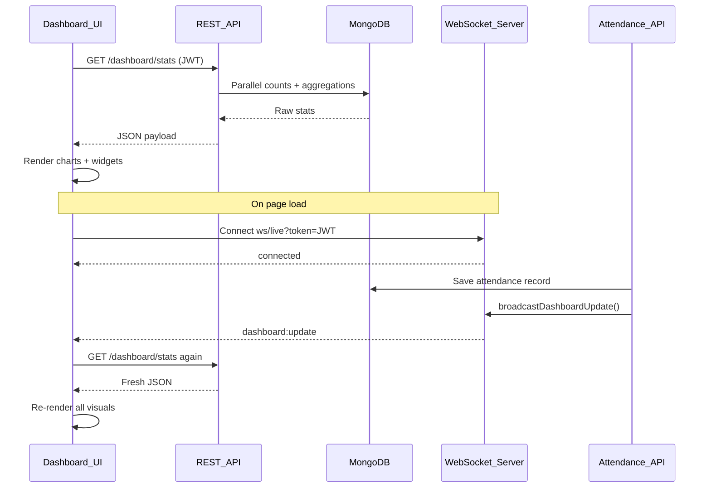
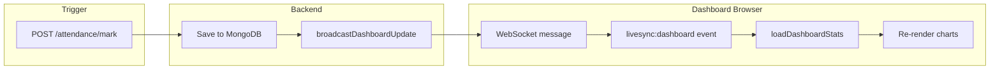

# Dashboard Charts — Complete Flow & Logic Guide

This guide explains **how every dashboard element works according to your actual code**, in a structure you can use for interviews, personal understanding, and portfolio discussions.

---

## 1. Big Picture (30-second interview answer)

> "The dashboard is a **read-heavy analytics page**. On load, the frontend calls `GET /api/dashboard/stats` with a JWT. The backend scopes all queries to **classes owned by the logged-in teacher**, runs parallel MongoDB counts/aggregations, and returns one JSON payload. The frontend renders stat cards, four chart/visual widgets, a timeline, and side widgets. When attendance is marked, the backend **broadcasts a WebSocket hint** (`dashboard:update`); the dashboard **does not receive new chart data over WS** — it re-fetches the full stats API and re-renders everything."



**Key files:**
- Frontend: [`frontend/js/dashboard.js`](../frontend/js/dashboard.js), [`frontend/js/liveSync.js`](../frontend/js/liveSync.js), [`frontend/pages/dashboard.html`](../frontend/pages/dashboard.html)
- Backend: [`backend/src/controllers/dashboard.controller.js`](../backend/src/controllers/dashboard.controller.js), [`backend/src/ws/liveSync.js`](../backend/src/ws/liveSync.js), [`backend/src/controllers/attendance.controller.js`](../backend/src/controllers/attendance.controller.js)

---

## 2. Page Boot Sequence

When [`dashboard.html`](../frontend/pages/dashboard.html) loads:

1. **Chart.js** is loaded from CDN (used for line + bar charts only).
2. Scripts load in order: `api.js` → `liveSync.js` → `dashboard.js`.
3. On `DOMContentLoaded` in [`dashboard.js`](../frontend/js/dashboard.js):
   - `initHeroClock()` — updates date/time every 1 second (pure UI, no API).
   - `AppLayout.init('dashboard')` — sidebar, auth, navbar.
   - `loadDashboardStats()` — **first data fetch**.
   - After both finish → `LiveSync.connect()` — opens WebSocket.
4. Event listeners:
   - **Refresh button** → `loadDashboardStats(true)` (shows toast).
   - **`livesync:dashboard`** custom event → `loadDashboardStats()` (silent refresh).

```javascript
document.addEventListener('DOMContentLoaded', () => {
  initHeroClock();
  document.getElementById('refreshDashboardBtn')?.addEventListener('click', () => loadDashboardStats(true));
  window.addEventListener('livesync:dashboard', () => loadDashboardStats());
  Promise.all([AppLayout.init('dashboard'), loadDashboardStats()]).then(() => {
    if (typeof LiveSync !== 'undefined') LiveSync.connect();
  });
});
```

---

## 3. The Central Data Loader: `loadDashboardStats()`

This is the **single orchestrator** for all dashboard visuals.

**Flow:**
1. Show loading state (`…` on stat cards, remove `is-live` CSS class).
2. Call `API.dashboard.getStats()` → `GET /api/dashboard/stats` with Bearer token.
3. Store response in `dashboardData`.
4. Call render functions in sequence:

| Function | UI element | Library |
|----------|-----------|---------|
| `updateHero()` | Greeting, insight, week-over-week trend | Plain DOM |
| `animateCounter()` × 4 | Stat cards | `requestAnimationFrame` |
| `updateStatTrends()` | ↑↓ arrows under stat cards | Plain DOM |
| `renderAreaChart()` | Weekly attendance trend | **Chart.js** (line + gradient fill) |
| `renderClassBarChart()` | Class comparison | **Chart.js** (grouped bar) |
| `renderHeatmap()` | 12-week activity grid | **CSS grid** (not Chart.js) |
| `renderPieChart()` | Present vs absent | **CSS `conic-gradient`** (not Chart.js) |
| `renderTimeline()` | Live activity feed | Plain DOM |
| `updateWidgets()` | Today's summary + health bar | Plain DOM |

**Important pattern:** Charts are **destroyed and recreated** on each refresh (`destroyChart()` → `new Chart()`), not incrementally updated. This keeps logic simple and avoids stale Chart.js state.

---

## 4. Backend: `GET /dashboard/stats`

**Route:** [`backend/src/routes/dashboard.routes.js`](../backend/src/routes/dashboard.routes.js) — protected by `verifyJWT`.

**Security scoping (critical for interviews):**
```javascript
const userId = req.user._id;
const classIds = await Class.find({ createdBy: userId }).distinct('_id');
```
Every attendance query filters by `class: { $in: classIds }`. A teacher only sees **their own** data.

**Date normalization:** All dates use UTC midnight via `getStartOfDay()` — one attendance record per student per calendar day (matches [`attendance.model.js`](../backend/src/models/attendance.model.js) unique index on `{ student, date }`).

### 4.1 Parallel DB queries (`Promise.all`)

The controller runs **12 queries in parallel** for speed:

- `Class.countDocuments` → total classes
- `Student.countDocuments` → total students in teacher's classes
- `Attendance.countDocuments` (today) → marked today
- `Attendance.countDocuments` (today + Present) → present today
- `Attendance.countDocuments` (all time) → total records
- `Attendance.countDocuments` (all time + Present) → total present
- `aggregateDailyStats()` → daily marked/present for last **84 days** (heatmap + weekly trend)
- `Attendance.aggregate` grouped by class → class comparison
- `Attendance.find` recent 12 → timeline
- `Class.find` recent 4 → timeline
- `Student.find` recent 4 → timeline
- `Class.find` all (for name mapping)

### 4.2 Core helper: `aggregateDailyStats`

```javascript
const aggregateDailyStats = async (classIds, startDate, endDate) => {
  const rows = await Attendance.aggregate([
    { $match: { class: { $in: classIds }, date: { $gte: startDate, $lt: endDate } } },
    { $group: {
        _id: { $dateToString: { format: '%Y-%m-%d', date: '$date' } },
        marked: { $sum: 1 },
        present: { $sum: { $cond: [{ $eq: ['$status', 'Present'] }, 1, 0] } },
    }},
  ]);
  return new Map(rows.map((row) => [row._id, { marked: row.marked, present: row.present }]));
};
```

Returns a `Map` like `"2026-06-08" → { marked: 15, present: 12 }`. This single aggregation powers **weekly trend**, **heatmap**, and **week-over-week comparisons**.

---

## 5. Each Visual — What It Shows & How It Updates

### 5.1 Stat Cards (4 cards)

| Card | Backend field | Meaning |
|------|--------------|---------|
| Total Classes | `totalClasses` | Count of classes where `createdBy = userId` |
| Total Students | `totalStudents` | Students in those classes |
| Marked Today | `attendanceToday` | Attendance docs with `date = today` |
| Attendance Rate | `attendancePercentage` | `(totalPresent / totalRecords) × 100` — **all-time**, not just today |

**Trend badges** (`statTrends`): compare this week vs last week:
- `classes`: new classes created this week vs prior week
- `students`: new students added this week vs prior week
- `today`: marked today vs marked on same weekday last week
- `percentage`: attendance rate this week vs last week (`weekOverWeekChange`)

**Frontend animation:** `animateCounter()` eases from 0 → target over 900ms using cubic ease-out (`requestAnimationFrame`).

---

### 5.2 Weekly Attendance Trend (Area/Line Chart)

**Backend:** `buildWeeklyTrend(today, dailyStatsMap)` loops **last 7 days** (today − 6 through today):

```javascript
trend.push({
  date: key,           // "2026-06-08"
  label: "Mon",        // weekday short name
  marked: day.marked,
  present: day.present,
  absent: day.marked - day.present,
  rate: day.marked === 0 ? 0 : Math.round((day.present / day.marked) * 100),
});
```

**Frontend:** [`renderAreaChart()`](../frontend/js/dashboard.js)
- **Y-axis:** attendance rate 0–100%
- **X-axis:** weekday labels (Mon, Tue, …)
- **Empty state:** if no day has `marked > 0`, shows placeholder SVG instead of chart
- **Tooltip:** shows both rate % and marked count
- Uses Chart.js `type: 'line'` with `fill: true` and a canvas gradient under the line

**Interview line:** "Rate is **per-day present/marked ratio**, not cumulative. A day with zero marks shows 0% on the chart."

---

### 5.3 Attendance Heatmap (12 weeks = 84 days)

**Backend:** loops 83 → 0 days back from today:
```javascript
heatmap.push({ date: key, count: marked, level: countLevel(count) });
```

**Intensity levels** (`countLevel`):
- 0 → level 0 (no activity)
- 1–2 → level 1
- 3–5 → level 2
- 6–10 → level 3
- 11+ → level 4

**Frontend:** [`renderHeatmap()`](../frontend/js/dashboard.js) builds a CSS grid of `<div class="heatmap-cell level-N">` — similar to GitHub contribution graph. **Not Chart.js.**

**Tooltip:** `title="${date}: ${count} marked"` on each cell.

---

### 5.4 Class Comparison (Grouped Bar Chart)

**Backend:** MongoDB aggregation groups **all-time** attendance by `class`:
```javascript
{ $group: { _id: '$class', total: { $sum: 1 }, present: { $cond: [...] } } }
```
Then maps class IDs to names and computes `rate = present/total × 100`. Sorted by rate descending.

**Frontend:** [`renderClassBarChart()`](../frontend/js/dashboard.js)
- Two datasets: **Present** (green) and **Absent** (red) per class
- Tooltip `afterBody` shows overall class rate %
- Chart.js `type: 'bar'` with `beginAtZero: true`

---

### 5.5 Present vs Absent (Pie Ring)

**Backend:** `distribution` object:
```javascript
{ present, absent, presentPercent, absentPercent }
```
Derived from **all-time** totals across teacher's classes.

**Frontend:** [`renderPieChart()`](../frontend/js/dashboard.js) — **pure CSS**, not Chart.js:
```javascript
conic-gradient(var(--success) 0% ${presentPct}%, var(--danger) ${presentPct}% 100%)
```
A donut ring with a legend below. Empty if `present + absent === 0`.

---

### 5.6 Live Activity Timeline

**Backend:** merges 3 sources into `recentActivity`, sorts by `at` descending, slices to 15:
1. Last 12 attendance marks (with student name, class, Present/Absent)
2. Last 4 students added
3. Last 4 classes created

**Frontend:** [`renderTimeline()`](../frontend/js/dashboard.js) renders `<li>` items with emoji icons by `variant` and relative time (`Just now`, `5m ago`, etc.).

---

### 5.7 Side Widgets

**Today's Summary** (`todaySummary`): `presentToday`, `absentToday`, `attendanceToday` — **today only**.

**Attendance Health** (`health`):
- `≥ 85%` → "Excellent"
- `≥ 70%` → "Good"
- `> 0 records but < 70%` → "Needs attention"
- else → "Getting started"

Health bar width animates to `attendancePercentage` (all-time rate).

---

### 5.8 Hero Section

- **Greeting:** time-based (morning/afternoon/evening) + teacher name from `localStorage` user.
- **Insight:** today's marked count and present count.
- **Trend line:** `weekOverWeekChange` — compares **this week's attendance rate** vs **last week's rate** (days 0–6 vs days 7–13).

---

## 6. Live Sync — How Real-Time Updates Work

This is a common interview topic. Your app uses a **"signal to refetch"** pattern, not **"push full data"**.



**Backend broadcast** ([`attendance.controller.js`](../backend/src/controllers/attendance.controller.js)):
```javascript
broadcastDashboardUpdate({ reason: 'attendance-marked' });
```

**WebSocket server** ([`liveSync.js`](../backend/src/ws/liveSync.js)):
- Authenticates via `?token=<JWT>` on connect
- Heartbeat ping/pong every 25s to drop dead connections
- `broadcastDashboardUpdate()` sends `{ type: 'dashboard:update', reason, ts }` to **all** connected clients

**Frontend** ([`liveSync.js`](../frontend/js/liveSync.js)):
- On `dashboard:update` message → dispatches `window` event `livesync:dashboard`
- Dashboard listener calls `loadDashboardStats()` — **full REST refetch**

**Live pill UI:** Shows `Synced live` / `Connecting…` / `Offline` based on WebSocket connection state only.

**Interview talking point:** "WebSocket is a lightweight notification channel. The actual chart data always comes from the REST API, which keeps a single source of truth and avoids syncing partial state over WS."

**Current limitation to know:** Only `markAttendance` triggers broadcast. Adding a class or student updates stats on next manual refresh or page reload (unless you add more `broadcastDashboardUpdate` calls elsewhere).

---

## 7. Chart.js vs Custom Rendering — Why Mixed?

| Visual | Technology | Reason |
|--------|-----------|--------|
| Weekly trend | Chart.js line | Needs axes, tooltips, smooth curves |
| Class comparison | Chart.js bar | Grouped bars with legend |
| Heatmap | CSS grid + classes | GitHub-style cells; Chart.js overkill |
| Pie | CSS conic-gradient | Simple 2-slice ring; no library needed |
| Timeline | HTML list | Text feed, not a chart |

**Chart lifecycle:** Before each render, existing Chart instances are `.destroy()`'d to prevent memory leaks and duplicate canvases.

---

## 8. API Response Shape (What Frontend Expects)

```json
{
  "data": {
    "totalClasses": 3,
    "totalStudents": 45,
    "attendanceToday": 12,
    "presentToday": 10,
    "absentToday": 2,
    "attendancePercentage": 87.5,
    "weekOverWeekChange": 2.3,
    "statTrends": { "classes": { "change": 1 }, "students": { "change": 5 } },
    "weeklyTrend": [{ "label": "Mon", "marked": 10, "present": 8, "rate": 80 }],
    "classComparison": [{ "name": "10A — A", "present": 20, "absent": 3, "rate": 87 }],
    "distribution": { "present": 350, "absent": 50, "presentPercent": 87.5 },
    "heatmap": [{ "date": "2026-06-08", "count": 12, "level": 3 }],
    "recentActivity": [{ "type": "attendance", "variant": "present", "text": "...", "at": "..." }],
    "todaySummary": { "present": 10, "absent": 2, "marked": 12 },
    "health": { "label": "Excellent", "level": "excellent" }
  }
}
```

---

## 9. Interview Q&A Cheat Sheet

**Q: How does the dashboard stay up to date?**
A: Initial REST fetch on load. WebSocket pushes a `dashboard:update` event when attendance is marked; frontend re-fetches `/dashboard/stats` and re-renders.

**Q: How is data isolated per teacher?**
A: All queries filter classes by `createdBy: userId`, then attendance by those class IDs.

**Q: What's the difference between "Marked Today" and "Attendance Rate"?**
A: Marked Today = count of records for today's date. Attendance Rate = all-time present ÷ all-time total records.

**Q: How is weekly trend calculated?**
A: For each of the last 7 days, `rate = present / marked × 100`. Days with no marks = 0%.

**Q: Why destroy and recreate Chart.js instances?**
A: Simpler than diffing datasets; prevents memory leaks when data structure changes or empty states swap canvas for placeholder HTML.

**Q: What MongoDB features do you use?**
A: `countDocuments`, `aggregate` with `$match`, `$group`, `$dateToString`, `$cond`, `Promise.all` for parallel queries, and a unique compound index on attendance.

**Q: What would you improve?**
A: Broadcast on class/student creation too; incremental Chart.js `.update()` for performance; teacher-scoped WS rooms instead of broadcast-to-all; caching dashboard stats with short TTL.

---

## 10. Mental Model Summary

```
Teacher logs in
    → Dashboard loads
    → JWT attached to GET /dashboard/stats
    → Backend: "What classes does this teacher own?"
    → Backend: Run all counts/aggregations in parallel
    → Backend: Build weeklyTrend, heatmap, classComparison, distribution, timeline
    → Frontend: One loadDashboardStats() paints everything
    → WebSocket connects (live indicator)
    → Someone marks attendance elsewhere
    → WS: "hey, refresh"
    → Frontend: Same loadDashboardStats() again
    → All charts/widgets update from fresh API data
```

This is a clean **separation of concerns**: backend owns business logic and aggregation; frontend owns presentation and animation; WebSocket owns **change notification only**.
